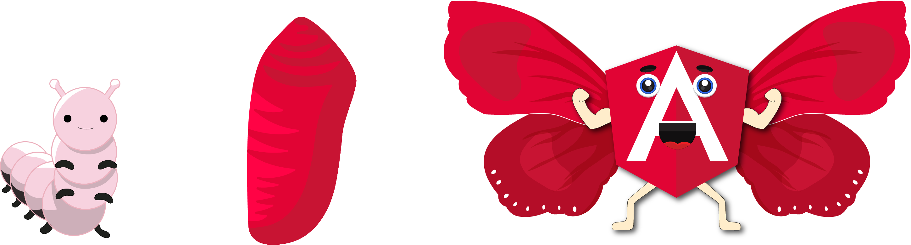

# 🦋 Bienvenid@s a la Metamorfosis de Angular 🦋

## 🌟 Introducción 🌟



La Metamorfosis de Angular, no es una comunidad, la misión de este espacio es empoderar y brindar un lugar de aprendizaje. La filosofia que recomiendo es la de: 👉  "**Aprender Haciendo o** _**Learning by Doing**_".  

Siguiendo cada uno de los niveles aprenderás a crear una aplicación de Angular. Esta metodología ha sido seguida en un Workshop, pero no necesitas ingresar a alguna sesión, ver algún video o pertencer a una comunidad, para usar estos recursos; la idea es que a través de esta guía inicies tus pasitos 🦶 en este gran Framework llamado Angular 👍. Incluso si deseas crer tu propio Workshop o Taller, que desees compartir en tu comunidad, puedes tomar como base esta guía para hacerlo.

Existen tres niveles: nivel 0 llamado Oruga 🐛, nivel 1 Crisalida 🐚 y nivel 2 Mariposa 🦋. Estos niveles no son de expertise en el framework, estaba basado en el conocimiento del programador con las tecnolgías Web y como se pretende que personas con 0 conocimientos en este campo tenga una primera aproximación a él.


## 🐛¿El porqué el nombre de la 'Metamorfosis'? 🐛

Cuando se menciona la palabra 'Metamorfosis', hablamos de un cambio, una transformación que vamos a hacer o que la naturaleza hace. En nuestro caso la idea es transformar esos conocimientos que se tienen nulos en una herramienta, pueda ser un proceso gradual, que al culminar ese proceso ustedes tengan una base para poder continuar por su cuenta su proceso de aprendizaje.

No pretendo que siguiendo este espacio puedan decir que son expertos en Angular, porque requiere de un continuo aprendizaje y dedicación para llegar a ser expertos.

## 🌟¿Qué encontrarás en esta guía?🌟

La idea de esta guia es darte un material extra al que encuentras en internet para que puedas hacer tu proceso de aprendizaje mucho más ameno.

Que encontrarás en esta guía:

* Encontrarás algunas definiciones básicas de conceptos que usamos para construir páginas o aplicaciones Web.
* Encontrarás líneas de código que estarán como se detalla en el siguiente bloque de código, podrás encontrar sea marcado HTML, estilos CSS, código en lenguaje JavaScript o TypeScript.


```bash
console.log('Hello World!!')
```



* Encontraras unos hint o consejos, que te ayudarán a comprender mejor algún concepto o es una recomendación de código.


 Tip: Profundiza los conceptos que mencionan en esta guía.


Es una recomendación, si quieres sumergirte a este mundo de la Web, aprendas las bases de la programación Web \(HTML, CSS, JS\) a tu ritmo, sin presión, pero haciendo un buen enfasis en las bases, para que puedas tranquilamente trabajar con cualquier libreria o framework de JavaScript.


