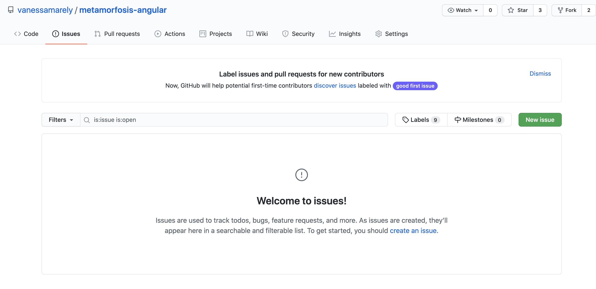

# Contribuir

👍🎉 Muchas gracias por ayudarme a mejorar esta guía 🎉👍

## ¿Cómo puedo contribuir?

### Recomendar mejoras

Al leer esta guía es posible que encuentres algunos errores en redacción, incluso puedes tener sugerencias o propuestas para que el contenido sea entregado de una forma más clara.

Puedes crear un issue \(usando [Github's issues](https://github.com/vanessamarely/metamorfosis-angular/issues)\) y dejar tu sugerencia 👍. 

Asegúrate de que tu **Issue** no se ha creado,  con anterioridad.

Dale un título suficientemente descriptivo y un texto que detalle tu issue.

 

