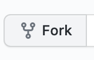

# Contribuir

👍🎉 Muchas gracias por ayudarme a mejorar esta guía 🎉👍

## ¿Cómo puedo contribuir?

### Recomendar mejoras

Al leer esta guía es posible que encuentres algunos errores en redacción, incluso puedes tener sugerencias o propuestas para que el contenido sea entregado de una forma más clara.

Puedes crear un issue \(usando [Github's issues](https://github.com/vanessamarely/metamorfosis-angular/issues)\) y dejar tu sugerencia 👍. 

Asegúrate de que tu **Issue** no se ha creado,  con anterioridad.

Dale un título suficientemente descriptivo y un texto que detalle tu issue.

### Completar algún tema o subtema

Si deseas completar alguno de los temas faltantes de la guía, puedes crear un issue con tu propuesta, o crear un **Pull Request.**

* Pull Request

Haz un _fork_ del repositorio, haciendo click en el botón de la cabecera del repositorio. Deberás haber hecho _login_ en tu cuenta de GitHub.

Deberás _clonarlo_ en tu equipo local.

Completar el tema o subtema, en el repositorio clonado a partir del _fork_

Sigue el procedimiento normal de un flujo de trabajo en git: _commit_, push etc.

Haz click en _**Compare and Pull Request**_ ****, se abrirá una página de discusión. En ella podrás incluir un título y una descripción opcional. Es importante que incluyas la información necesaria que explique tu propuesta. El moderad@r del proyecto analizará tus cambios \(recuerda que el moderad@r  del proyecto puede tener otras propuestas antes de la tuya o cambios que pueden ser generadores de conflicto con tu aporte\).

Envía el _**pull request**_

###  Proponer Retos o ejercicios

Si tienes una sugerencia de ejercicio o reto, puedes crear un issue con tu propuesta, o crear un **Pull Request.**

* Pull Request

Haz un _fork_ del repositorio, haciendo click en el botón de la cabecera del repositorio. Deberás haber hecho _login_ en tu cuenta de GitHub.

Deberás _clonarlo_ en tu equipo local.

Crea el archivo de reto o ejercicio, en el repositorio clonado a partir del _fork_

Sigue el procedimiento normal de un flujo de trabajo en git: _commit_, push etc.

Haz click en _**Compare and Pull Request**_ ****, se abrirá una página de discusión. En ella podrás incluir un título y una descripción opcional. Es importante que incluyas la información necesaria que explique tu propuesta. El moderad@r del proyecto analizará tus cambios \(recuerda que el moderad@r del proyecto puede tener otras propuestas antes de la tuya o cambios que pueden ser generadores de conflicto con tu aporte\).

Envía el _**pull request**_

### Traducciones

Esta guía fue creada en español, y como recurso de aprendizaje sería bueno poder traducirlo  y tener varias versiones de el, para ayudar puedes crear un issue con tu propuesta, o crear un **Pull Request.**

