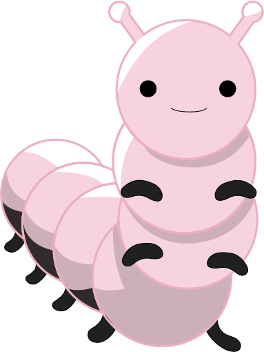

# 🐛 Bienvenid@s 🐛

## Introducción 💪

Si estás leyendo este contenido es porque deseas iniciar ese proceso de transformación, abiert@ a aprender una cantidad de conceptos que es posible que no dominas, o que en algún momento escuchaste algo, pero espero que al finalizar este nivel, puedas sentirte con la satisfacción de haber profundizado o conocido 👍.&#x20;

Basada en la experiencia que adquirí organizando eventos en comunidades y Workshops, intente elaborar el contenido de este material, presentándote una propuesta diferente a las que sueles encontrar (espero haber logrado ese objetivo 😅 ).&#x20;

Usando este material puedes convertirte en un ment@r 💪. Puedes enseñarle a alguien como utilizar este material y como puede comenzar este proceso de transformación 👊.

## Temas 🤩

En este nivel 0 Oruga, te preguntarás ¿qué temas encontrarás? Si he escuchado algunos conceptos, o para aquellas personas que vienen de otros campos diferentes a la programación y nunca han escuchado sobre ella.

* Introducción a la programación
* Herramientas que puedo usar
* Introducción a la Web
* ¿Qué es HTML?
* ¿Qué es CSS?
* ¿Qué es JavaScript?
* ¿Que es TypeScript?
* ¿Que es Angular?
* Conceptos básicos en Angular
* Nuestra primera aplicación en Angular
* Reto en Angular

## . Recuerda 👀

* ✔️Si tienes dudas en algún tema y deseas profundizar, pero no sabes donde encontrar material, me puedes escribir vía Twitter: @vanessamarely o a mi correo vanessamarely@gmail.com, colocando en el asunto: ’Mentoría Metamorfosis de Angular’.
* ✔️ Si consideras que el contenido que encuentras en esta guía no aporta mucho, me puedes escribir con tus sugerencias y comentarios, para poder con tu ayuda mejorar este espacio 💪. Escríbeme a mi correo vanessamarely@gmail.com, colocando en el asunto: ’Sobre Metamorfosis de Angular’.
* ✔️ La idea es que este proceso lo hagas a tu ritmo, si tienes alguna duda pregúntame, siempre estaré dispuesta a ayudarte, Twitter: @vanessamarely o correo vanessamarely@gmail.com 👍
