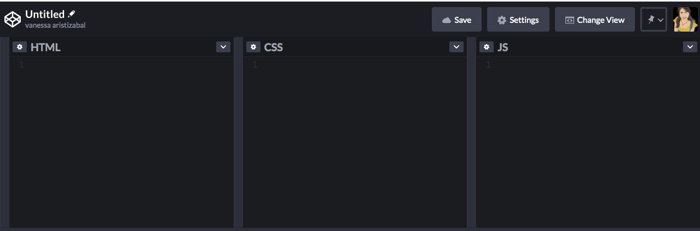
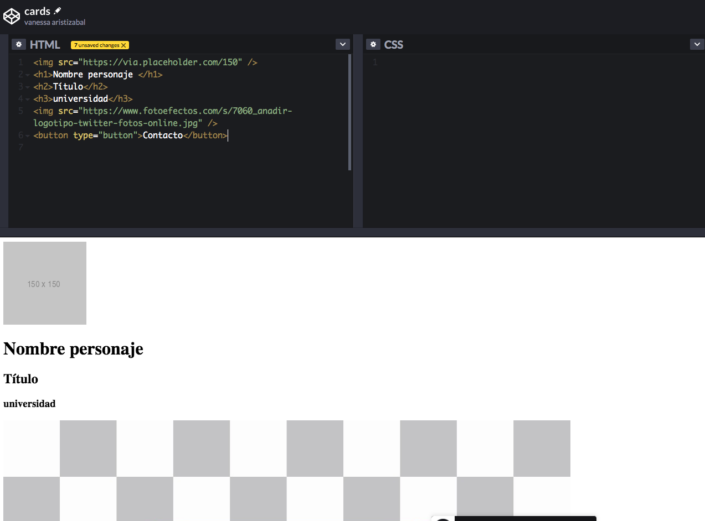

# 📄 Ejercicio HTML & CSS 🎨

Como menciona la metodología de este workshop se aprende haciendo y por ello te invito a practicar un poco las etiquetas. y los estilos, la idea es que uses la teoría o investigues un poco en internet para lograr el resultado esperado y tambien uses un poco la imaginación para añadir más elementos, si lo deseas.

## Creemos unas tarjetas de personajes

Para hacer nuestra tarjeta de personajes nos basaremos en la siguiente imagen:


* Primero lo que haremos será crear nuestro documento html base, esto lo haremos en un editor, puede ser visual studio code \(local en tu maquina\) o [codepen](https://codepen.io/).

```markup
<!DOCTYPE html>
<html>
    <head>
    <title>Page Title</title>
    </head>
<body>

</body>
</html>
```

En el caso de que uses codepen, no es necesario crear la estrucutura anterior, por defecto esta viene incluida internamente y lo que colocaras en las sección del HTML será solo las etiquetas que estarían en el &lt;body&gt;&lt;/body&gt;

La siguiente imagen sería como se veria tu codepen:



* En la seccion del HTML, crearemos nuestras etiquetas.

Como es una card, analicemos que elementos tiene:

-- Imagen

-- Nombre del personaje

-- Título del personaje

-- Redes sociales

-- botón de contact

* Una vez analices los elementos, podemos empezar a crear las etiquetas, HTML tienen algunas etiquetas de significado semántico, algunas son demasiado intuitivas para con solo leer la etiqueta saber que puede hacer en el documento.

La etiqueta &lt;img /&gt; nos ayuda a añadir imagenes. Podemos usar una imagen placeholder quedando de esta manera nuestra etiqueta:

```markup

```

* Para el nombre del personaje ,título y universidad, podemos usar un h1, h2 y h3.

```markup
<h1>Nombre personaje </h1>
<h2>Título</h2>
<h3>universidad</h3>
```

* Luego vendrian las redes sociales, que las podemos colocar usando imagenes, como por ejemplo:

```markup

```

* Luego vendría un boton

```markup
<button type="button">Contacto</button>
```

Ya tenemos nuestra card pero se va a ver muy desorganizada:



Vamos a colocar esos elementos que tenemos dentro de una caja contenedora o un elemento que sea el que los contenga como un &lt;div&gt;&lt;/div&gt;, esta etiqueta es muy general.

* Nuestro HTML quedaría así:

```markup
<div>
  
  <h1>Nombre personaje </h1>
  <h2>Título</h2>
  <h3>universidad</h3>
  
  <button type="button">Contacto</button>
</div>
```

Ahora es momento de colocar estilos, y en la sección de codepen que dice CSS, ahi los vamos a incluir. Empezaremos creando selectores de etiqueta y empezaremos a hacer los ajustes necesario para ver bien nuestra card.

Si agregamos los siguientes estilos, van a notar que nuestra card se va ajustando poco a poco.

```css
div {
  background-color: black;
  height: 400px;
  width: 200px;
}

img {
  width: 100%;
}

button {
  background-color: black;
  border: 0;
  color: white;
  font-size: 16px;
  padding: 5px;
  width: 100%;
}

```

Para diferenciar las dos images, que una es de red social y la otra es la imagen del personaje, podemos añadir una tributo clase a una de las imagenes, para diferenciarla, por ejemplo:

```markup

```

Para añadir los estilos usamos el selector de clase:

```css
.social {
    width: 50px;
}
```

Te invito a terminar el ejercicio tomando como base el mockup o imagen de la card y aplicando los tags o etiquetas que consideres necesarios, ademas de los estilos.

