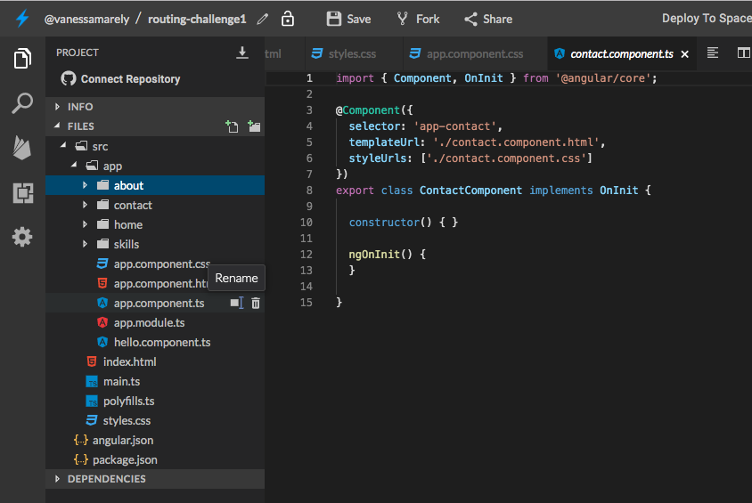

# 🏗️ Nuestra primera aplicación en Angular 🏗️

Para realizar nuestra primera aplicación vamos a hacer uso de Stackblitz, para crear nuestra primera SPA en Angular.

Podemos trabajar localmente en nuestros equipos, pero este será el siguiente paso una vez tengas tu aplicación creada en Stackblitz, para que aprendas como podemos hacerlo de las dos formas.

## Paso 1: **Creemos nuestra App de Angular** ⭐️ <a id="paso-1-creemos-nuestra-app-de-angular"></a>

Primero iremos a el inicio de [**www.stackblitz.com**](https://stackblitz.com/) y crearemos una App de Angular.


Vamos al inicio de Stackblitz y damos click en el botón.


Seleccionamos la opción de Angular


Verás algo como esto 👆

En la parte izquierda donde dice "Files", seleccionaremos el archivo llamado **app.component.html**.

Dentro del archivo seleccionamos su texto, lo borramos \(presionando la tecla delete de tu compu 💻\) y guardamos los cambios, seleccionando en la parte superior la opción de '**Save**' 💾 o la tecla rápida **cmd** + **S** o en windows **Ctrl** + **S.**


## Paso 2: **Añadamos un título** 🏁

En el mismo archivo **app.component.html,** vamos a usar unas etiquetas o tags de **HTML** para poner un título.

Copiaremos lo siguiente en el archivo **app.component.html** 



```markup
<h1>My App 😉</h1>
```



Para la fuente puedes usar cualquier tipografía de google como la siguiente e importarla en el archivo styles.css y aplicar la fuente a todos los elementos, así:



```css
/* Add application styles & imports to this file! */
@import url('https://fonts.googleapis.com/css?family=Open+Sans&display=swap');
* {
  font-family: 'Open Sans', sans-serif;
}
```



O puedes usar alguna otra del catálogo:

[https://fonts.google.com/](https://fonts.google.com/)

A nuestro título, lo pondremos dentro de la etiqueta header y le añadiremos un atributo clase. Como este es el nivel intermedio y ya sabes como poner algunos elementos, entonces no te mostraremos como poner la etiqueta o el color en el paso a paso.

##  Paso 3: Crearemos varios componentes 💪

Cuando visitas una página web, puedes observar que ella tiene muchas secciones como información de una empresa/producto, detalles de servicios, información de contacto entre otras. En este paso crearemos varios componentes, que serán donde iremos a colocar cada una de las secciones de nuestra página.

Dando clic derecho sobre la carpeta App, se desplegará un menú, en el seleccionaremos la opción **Angular Generator** y luego seleccionamos componente.

Nos aparece un campo de texto donde colocaremos el nombre para nuestro componente.

Le colocaremos el nombre home y presionamos enter y se nos creará nuestro nuevo componente.

Repetiremos el mismo paso para la creación del componente para crear otros 3 nuevos componentes, los llamaremos about, skills y contact.

Nuestra carpeta app, lucirá así:



## Paso 4: Añadiendo un Menu 📋

Añadamos un componente para crear nuestro menú en él.

Entonces seguimos los pasos anteriores y crearemos nuestro componente menú.

En el archivo **menu.component.html** vamos a poner la etiqueta &lt;nav&gt; donde pondremos cada uno de los links que nos llevarán a cada componente. Esos links los pondremos en una lista.

Nuestra lista se verá parecida al siguiente código, pero en la vista o **HTML** aún  no veremos nuestra lista hasta que la incluyamos en nuestro componente  App. 



```markup
<nav>
  <ul>
    <li><a>About</a></li>
    <li><a>Skills</a></li>
    <li><a>Contact</a></li>
  </ul>
</nav>
```



En el archivo **menu.component.ts** existe una línea donde encuentras el '**selector**' y ese es el que se debe añadir en el **app.component.html**

Copia el selector y añádelo como etiqueta en la vista del componente App.

Ahora debemos unir cada uno de los links a los respectivos componentes.

## Paso 5: Uniendo los componentes a sus links 🕹️

Vamos a crear un módulo router, para controlar todas nuestras rutas.

En la carpeta **app**, vamos a dar clic derecho y en la opción Angular Generator, seleccionaremos Module y lo llamaremos routing.

En nuestro nuevo archivo vamos a incluir las rutas y para ello debemos importar el RouterModule e incluir en los import la colección de nuestras rutas.

* Incluimos el import

```typescript
import { RouterModule } from '@angular/router';
```

* En los import colocaremos la colección usando el forRoot.

```typescript
RouterModule.forRoot([
      { path: 'about', component: AboutComponent },
      { path: 'contact', component: ContactComponent },
      { path: 'home', component: HomeComponent },
      { path: 'skills', component: SkillsComponent },
      { path: '**', redirectTo: 'home' }
    ]);
```

* Debemos también importar los componentes que estamos mencionando en la colección de rutas, para que no salga error en nuestra aplicación.

```typescript
import { AboutComponent } from '../about/about.component';
import { ContactComponent } from '../contact/contact.component';
import { HomeComponent } from '../home/home.component';
import { SkillsComponent } from '../skills/skills.component';
```

* Debemos incluir también nuestros componentes en los declarations.

```typescript
declarations: [ AboutComponent, ContactComponent, HomeComponent, SkillsComponent]
```

También podemos crear una variable donde almacenemos la colección de nuestras rutas y la pondremos en nuestro forRoot, pero esta es solo otra alternativa.



```typescript
import { NgModule } from '@angular/core';
import { CommonModule } from '@angular/common';
import { RouterModule } from '@angular/router';
import { AboutComponent } from '../about/about.component';
import { ContactComponent } from '../contact/contact.component';
import { HomeComponent } from '../home/home.component';
import { SkillsComponent } from '../skills/skills.component';

@NgModule({
  imports: [
    CommonModule,
    RouterModule.forRoot([
      { path: 'about', component: AboutComponent },
      { path: 'contact', component: ContactComponent },
      { path: 'home', component: HomeComponent },
      { path: 'skills', component: SkillsComponent },
      { path: '**', redirectTo: 'home' }
    ])
  ],
  declarations: [ AboutComponent, ContactComponent, HomeComponent, SkillsComponent]
}) 
export class RoutingModule { }
```



* Aún no hemos incluido el archivo routing.module en nuestro app, para esto en el archivo **app.module.ts**, importamos nuestro archivo **routing.module.ts**



```typescript
import { RoutingModule } from './routing/routing.module';
```



Incluimos en la colección de imports nuestro '**RoutingModule**'

```typescript
imports:      [ BrowserModule, FormsModule, RoutingModule ],
```

En nuestro **app.module.ts** aparecen importados los componentes que ya incluimos en el **routing.module.ts**, entonces lo que haremos es borrar los que ya están en el routing. Nuestro **app.module.ts** quedará así:



```typescript
import { NgModule } from '@angular/core';
import { BrowserModule } from '@angular/platform-browser';
import { FormsModule } from '@angular/forms';

import { AppComponent } from './app.component';
import { MenuComponent } from './menu/menu.component';

import { RoutingModule } from './routing/routing.module';

@NgModule({
  imports:      [ BrowserModule, FormsModule, RoutingModule ],
  declarations: [ AppComponent, MenuComponent ],
  bootstrap:    [ AppComponent ]
})
export class AppModule { }

```



* Nos falta incluir estas rutas que creamos de nuestros componentes en el menú que incluimos y usar la etiqueta &lt;router-outlet&gt; que nos ayudará a mostrar el contenido de nuestros componentes

En nuestro **app.component.html** vamos a incluir nuestra etiqueta &lt;router-outlet&gt; &lt;/router-outlet&gt;, dentro de estas etiquetas se va a mostrar todo el contenido de nuestros componentes.



```markup
<header class="header">
  <h1>My App 😉</h1>
</header>
<app-menu></app-menu>
<router-outlet></router-outlet>
```



Al incluir nuestra etiqueta saldrá un error parecido al siguiente y es porque nos falta exportar nuestro módulo de Routing, y para esto es solo que incluyamos el export, en nuestro NgModule, en el **routing.module.ts** así:



```typescript

@NgModule({
  imports: [
    CommonModule,
    RouterModule.forRoot([
      { path: 'about', component: AboutComponent },
      { path: 'contact', component: ContactComponent },
      { path: 'home', component: HomeComponent },
      { path: 'skills', component: SkillsComponent },
      { path: '**', redirectTo: 'home' }
    ])
  ],
  declarations: [ AboutComponent, ContactComponent, HomeComponent, SkillsComponent],
  exports: [
    RouterModule,
  ]
}) 

```



* Solo falta incluir en nuestros links la ruta de nuestros componentes y para ello vamos a hacer uso de unos atributos que tiene el enrutamiento o Routing, llamados **routerLinkActive** y **routerLink**. En cada uno de nuestros links incluiremos que nuestro link esta activo y le pondremos en el routerLink el path que asignamos en el RouterModule. En el archivo **menu.component.html** añadiremos lo mencionado.



```markup
<nav>
  <ul>
    <li><a routerLinkActive="active" 
      routerLink="/home">Home</a></li>
    <li><a routerLinkActive="active" 
      routerLink="/about">About</a></li>
    <li><a routerLinkActive="active" 
      routerLink="/skills">Skills</a></li>
    <li><a routerLinkActive="active" 
      routerLink="/contact">Contact</a></li>
  </ul>
</nav>
```



Si damos clic en cada uno de los links podremos ver el contenido de cada componente.

Como puedes notar no hay mucho contenido en nuestros componentes, entonces podemos incluir alguno de contenido en ellos. 

## Paso 6: Añadamos algo de contenido 🤡

En cada componente cambia su contenido, si estas creando una SPA personal, tipo portafolio añade tu información personal con imagenes.

De lo que creamos anteriormente puedes ver el ejemplo aquí: 




## Aplicación local

Hasta este punto sabes como crear una aplicación en stackblitz. Para crear esta misma aplicación localmente debes tener instalado node.js y un IDE \(Visual Studio Code es una buena opcion\). Una vez lo instales debemos en tu terminal preferida, instalar Angular usando el siguiente comando:

```bash
npm install -g @angular/cli
```

Para verificar que tienes instalado node.js antes del anterior comando, solo colocas en la terminar

```bash
node -v
npm -v
```

* Vamos a crear el workspace o ambiente de trabajo. Cuando haya terminado de instalar el angular/cli, debes ejecutar el siguiente comando:

```bash
ng new my-app
```

Con ese comando indicamos que queremos crear una nueva aplicación. Cuando estes instalando te va a preguntar si deseas añadir el routing, le escribes  Y \(seria yes\), te mostrá algo similar a esto:  'Would you like to add Angular Routing?'. Eso es lo unico que necesitamos decirle Y.  
Cuando te pregunte por el stylescheet selecciona CSS.

Para ejecutar nuestra aplicación debemos ir a la carpeta que se genero, ejecutamos lo siguiente en la terminal:

```text
cd my-app
ng serve --open
```

Una vez ejecutado nuestro proyecto, podremos ver el hola por defecto de Angular, similar ald e stackblitz.

Una vez se crea el poryecto, en el archivo que se genera de rutas, puedes copiar las rutas que habiamos creado en Stackblitz y lo que faltaria por hacer, sería crear nuestros componentes.

Angular tiene algo que se llama schematics, que te permite ejecutar pequeñas instrucciones para generar los archivos y añadir las rutas respectivas donde se necesitan. Para crear los componentes, lo haremos asi:

```text
ng generate component <name> [options]​
```

Se puede usar la forma abreviada:

```text
ng g c <name> [options]​
```

Se pueden usar cualquiera de los dos comandos anteriores, el options no es necesario, de esta forma crearemos todos los componentes que teniamos en nuestro stackblitz.


Si tienes alguna duda no dudes en contactarme. [  
](https://ngchallenges.gitbook.io/project/interpolacion)


**Contacto**:   
**correo** vanessamarely@gmail.com   
**twitter**: @vanessamarely



