# 🎨 ¿Qué es CSS? 🎨

## 🎨Introducción al CSS🎨

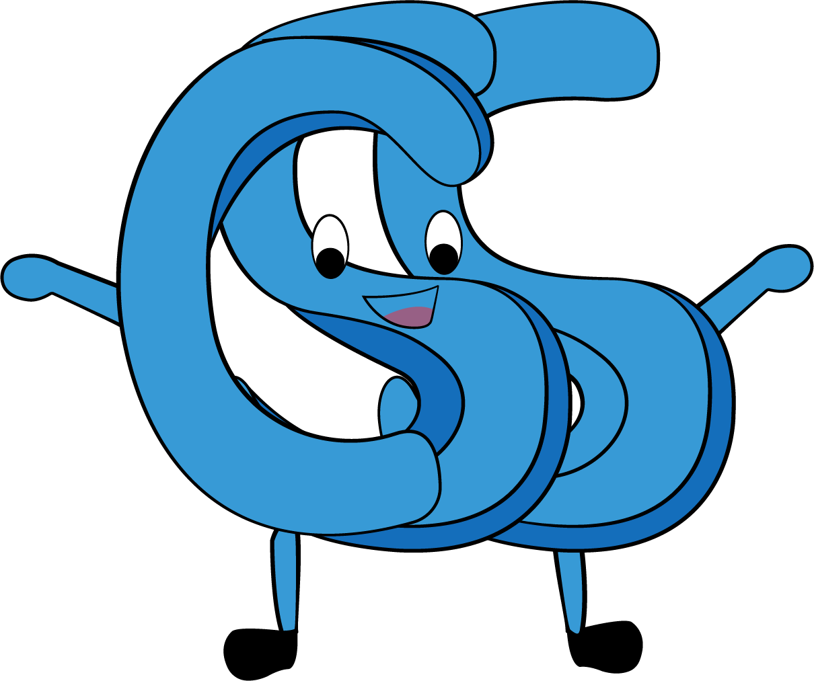

Las siglas de **CSS** significan “Cascade Style Sheet” u "Hoja de estilo en cascada". 

Son un conjunto de instrucciones que nos permiten definir la apariencia de los diferentes elementos o etiquetas del HTML. A este conjunto de instrucciones podemos llamarlas reglas.

Hay diferentes formas de aplicar el CSS, podemos colocarlo en cada etiqueta o podemos hacerlo haciendo uso de un archivo con la extensión '**.css**' o podemos colocar los estilos dentro de una etiqueta _**&lt;style&gt;&lt;/style&gt;**_.

Si queremos aplicar por ejemplo un color a un párrafo, dentro de la etiqueta &lt;p&gt;&lt;/p&gt;, se haría algo así: 

```markup
<p style="color:red">Text</p>
```

Si queremos aplicar el color rojo a todos los parrafos, lo podemos hacer asi:

```markup
<style>
    p {
        color: red;
    }
</style>
```

Si deseamos incluir un archivo CSS en nuestro documento lo incluimos dentro de la etiqueta _**&lt;head&gt;&lt;/head&gt;**_, haciendo uso de la etiqueta _**&lt;link&gt;**_, en esta etiqueta añadimos el atributo _**rel**_, con el valor _**stylesheet**_ y el atributo _**href**_, donde colocamos la ruta de nuestro archivo.

```markup
<!doctype html>
<html>
    <head>
        <title>Titulo del documento</title>
        <link rel="stylesheet" href="style.css" />
    </head>
    <body>
        <!-- otras etiquetas -->
    </body>
</html>
```

### ¿Qué podemos hacer con CSS?

* Podemos aplicar la misma regla a multiples elementos.
* Podemos cambiarle los estilos a los diferentes estados que tienen los elementos, como el **hover, focus**, etc.
* Podemos cambiar la posición de los elementos en el documento.
* Podemos transformar los elementos con propiedades como por ejemplo: scale, rotate, skew, etc.
* Podemos crear animaciones.
* Podemos crear reglas para diferentes tamaños e incluso diferentes dispositivos o media: print, screen, etc.

### Sintaxis

Los estilos CSS consisten en unas reglas que el navegador interpreta y aplica a los elementos correspondientes, como parrafos, secciones, encabezados, bloques, etc.

Una regla tiene dos partes importantes un selector y puede tener una o más declaraciones:

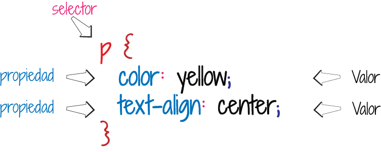

El selector es donde especificamos a cuales elementos o elemento del documento html se le aplicara la regla. En cada selector se hace una declaración, donde se especifica una propiedad y su valor correspondiente, finalizando con un ';'.

Existen varias propiedades que se pueden aplicar sobre un elemento, por ejemplo:

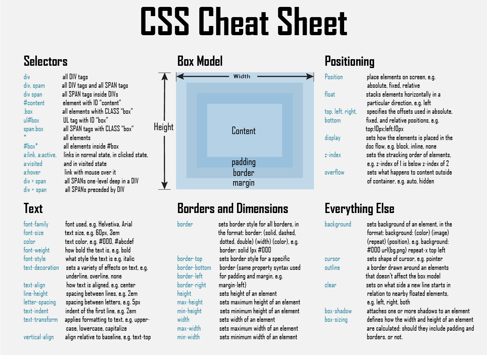

### Comentarios en CSS

Los comentarios en CSS, al igual que en HTML se añaden para hacer más legible para quien esta leyendo nuestras reglas, la compresión de estas. Los comentarios inician con _**/\***_ y terminan con _**\*/**_, como el siguiente ejemplo:

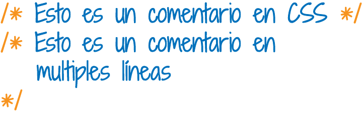

## Selectores

Un selector es un patrón para aplicar a un atributo del html la regla que esta asociada en los estilos, por ejemplo: 

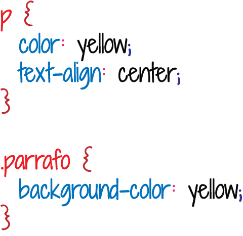

```markup
<p class="parrafo">Este es un parrafo</p>
```

Al elemento p, se les aplican unos estilos como el color y la alineación del texto y como esta etiqueta tiene un atributo llamado clase o class, en el CSS, se puede hacer uso de el, tomando la palabra y anteponiendole el '**.**', en este caso se le esta aplicando a la clase parrafo un color de fondo.

Existen varios tipos de selectores:

#### Selector Universal

Este selector se usa empleando el asterisco \(**\***\) y hace referencia a todos los elementos. Si deseamos hacer una especie de reset en nuestros estilos podemos emplear este selector, por ejemplo:


#### Selector de etiqueta o elemento \(Tag Selector\)

Este selector corresponde al elmento HTML y aplica la regla correspondiente a este elemento, por ejemplo:

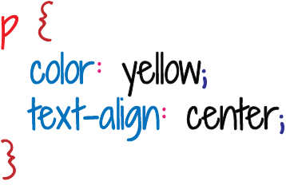

#### Selector de Clase \(Class Selector\)

Este selector se aplica para los elementos HTML que contengan el atributo clase o class \(que es como se escribe en el elemento\). Se inicializa con el '.' seguido de su nombre, que contendra la regla de estilos que deseemos definir; por ejemplo:

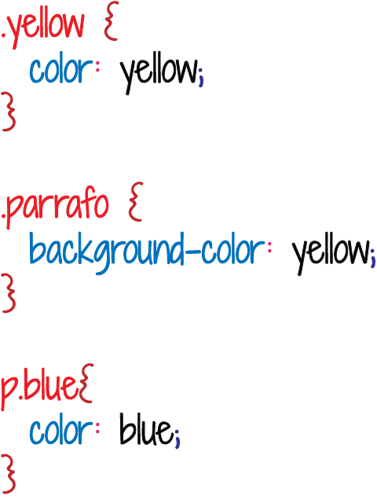

Como se muestra en la ultima regla, podemos hacer la regla más especifica colocando al selector de etiqueta que contenga la clase blue, aplicación del color: blue.

```markup
<p>Este es un parrafo</p>
<p class="parrafo">Este es otro parrafo </p>
<p class="parrafo blue">Este es el último parrafo</p>
```

#### Selector de ID \(ID Selector\)

Este selector es usado para colocar una regla a un unico elemento, porque un elemento puede tener muchas clases en el atributo class, pero solo puede tener un id, en el atributo id y debe ser unico por documento. Se inicia con el numeral \(**\#**\), seguido del nombre del id, y se especifican los estilos que se desea que este selector tenga. Por ejemplo:

#### 

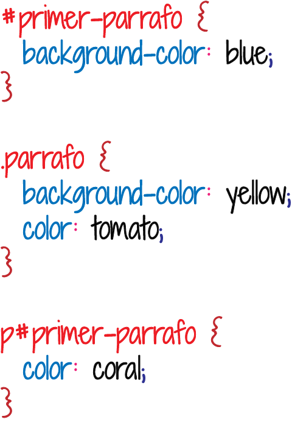

Como se muestra la última regla se puede ser más especifico y aplicarle a un selector de tipo elemento, el selector id.

```markup
<p id="primer-parrafo" class="parrafo">Este es otro parrafo </p>
<p class="parrafo blue">Este es el último parrafo</p>
```


Cuando se declara un id a un elemento, otros elementos no pueden tener el mismo, ya que debe ser unico por documento html.


#### Selector Descendiente \(Descendant Selector\)

El selector descendiente es el elemento que es descendiente de otro elemento, por ejemplo si deseamos aplicarle un color a un **anchor** o **hipervinculo** o etiqueta **&lt;a&gt;&lt;/a&gt;**, que se encuentra en una lista.

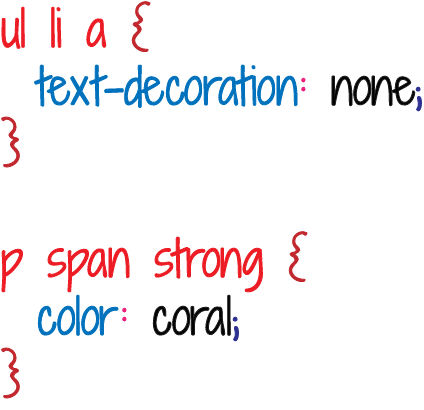

```markup
<ul>
    <li>
        <a href="home.html">Home</a>
    </li>
</ul>
 
<p><span>Hola <strong>Mundo!</strong></span></p>   
```

#### Selector Hijo \(Child Selector\)

Es usado para aplicar los estilos a los hijos directos de un elemento. Puede estar hecho por dos o más selectores que estan separados con el signo mayor que \(**&gt;**\). Se puede usar este selector para seleccionar el primer nivel de los elementos anidados. Por ejemplo: 

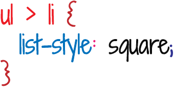

```markup
<ul>
    <li>
        Item
    </li>
</ul>
```

#### Selector Adyacente Hermano \(Adjacent Sibling Selector\)

Este selector puede ser usado para seleccionar los elementos hermanos \(los que estan al mismo nivel\). Su sintaxis es un elemento seguido del signo más \(**+**\) y luego el otro elemento, donde el objetivo a aplicarle los estilos es el segundo elemento; por ejemplo: h1+ p { }

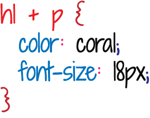

```markup
<div>
    <h1>Este es un titulo </h1>
    <p>Este es un parrafo</p>
</div>
```

#### Selector General de Hermanos \(General Sibling Selectors\)

Es parecido al adyacente pero no es tan estricto. Se pueden seleccionaar dos selectores separados por una virgulilla \(**~**\). Se puede tener un elemento separado por la virgulilla, seguido del otro elemento, y el objetivo del selector para aplicar los estilos es el segundo. Ambos elementos deben tener el mismo padre. Por ejemplo:

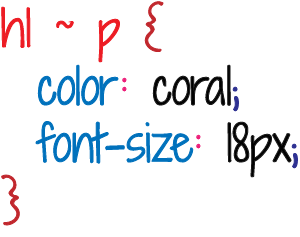

#### Selector de Atributo \(Atribute Selectors\)

Estos selectores tienen la particularidad que permiten aplicarle estilos a los elementos que tienen atributos, por ejemplo si deseamos aplicarle estilos a una etiqueta &lt;input /&gt; que tienen un atributo type, podemos hacer la regla especifica a ese type.

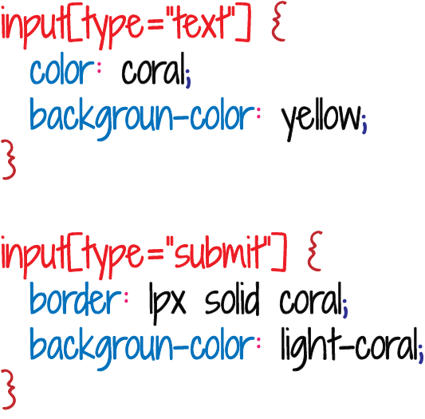

```markup
<form>
    <input type="text" placeholder="nombre" />
    <input type="submit" value="enviar" />
</form>
```

### Pseudo-clases \(Pseudo-Classes\)

La pseudo-clase permite colocarle estilos a un estado especial de los elementos, como: hover, focus, visited, etc. Inicia con los dos puntos \(:\), seguido de la pseudo-clase: selector:seudo-clase { propiedad: valor;}; por ejemplo:


 

### Pseudo-Elementos \(Pseudo-Elements\)

Estos se añaden a los selectores, pero no describen un estado como las pseudo-clases, estos permiten añadir estilos a un elemento o una parte muy especifica de él. Para añadir el pseudo-elemento se coloca despues del selector dobles puntos '::', su sintaxis sería: selector::pseudo-elemento ´propiedad: valor; }; por ejemplo: 

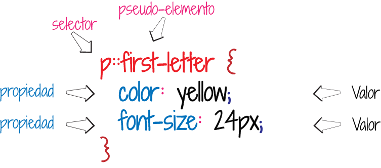

### ¿Porqué se le llaman estilos en Cascada al CSS?

Para estilizar un elemento se aplican estilos y se pueden aplicar varios estilos a un mismo elemento, incluso se puede hacer uso de todos los selectores anteriormente mencionados, y aplicar diferentes propiedades, pero existen tres conceptos claves, o normas que determinan cuando una regla se aplica sobre un determinado elmento, y estas son: importancia, especificidad y order de aparición.

#### Importancia

Una regla es determinada dependiendo donde este incluida. Existen varias hojas de estilo que es bueno conocerlas:

* Agente de usuario: son las hojas de estilo del navegador por defecto.
* CSS del usuario: son los estilos que modifica el usuario desde el navegador.
* CSS del autor: son los estilos que crea el desarrollad@r de la página.


Para colocar importancia a una regla especifica, se puede hacer uso al final del valor del **!important**, esta añade prioridad sobre las demas y lo que veriamos reflejado son los estilos que la contengan.


#### Especificidad

Son un conjunto de reglas que indican el peso de los selectores. Cada selector tiene una puntuación, el que sume más puntos es el que gane y por ende seria la regla que visualizariamos. Existe una calculadora que te puede ayudar a indetificar el peso de tus selectores, que puedes encontrar en el siguiente [link](https://specificity.keegan.st/). 

#### **Orden**

Es posible crear las mismas reglas para aplicar a un mismo elemento, pero para este caso se recuerda que importa donde este creada esa regla.

* Si la regla se aplica en linea a un elemento HTML tiene mayor prioridad
* Si se crea dentro de una etiqueta &lt;style&gt;/&lt;style&gt;, quedaria en segundo lugar.
* Si se crea en un archivo '**.css**', esta quedaria en tercer lugar


La regla que este creada de último es la que tiene la precedencia, porque sobreescribe a su regla anterior


### Modelo de Caja \(Box Model\)

Cada elemento HTML, esta contenido dentro de un modelo de caja, la cual contiene una serie de propiedades que afectan como se puede nostrar el elemento. Las propiedades principales son height, width, margin, padding, border.

Si tomaramos una analogia de la vida real, un vecindario, especificamente una casa, esta tiene un ancho y un alto, y esta rodeada por una cerca que seria el borde, su margin seria el espacio entre la cerca y la acera o , y el padding seria el espacio interno que tiene la casa, entre la cerca y la casa \(podria ser la grama, que esta entre la cerca y la casa\).

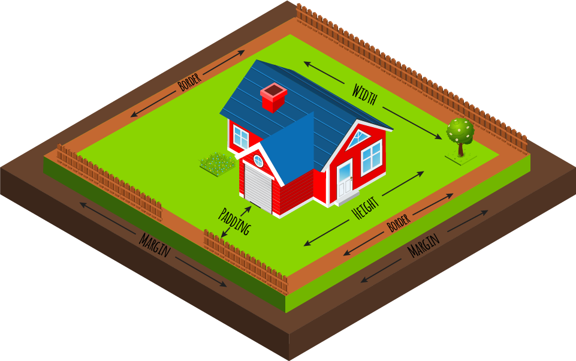


Existen mucha información sobre CSS, de sus propiedades y reglas las cuales pueden ampliar en el siguiente link: [mdn](https://developer.mozilla.org/es/docs/Web/CSS).

