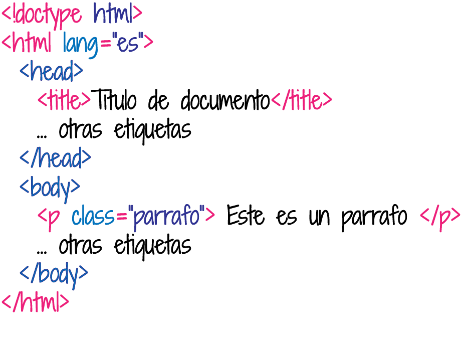
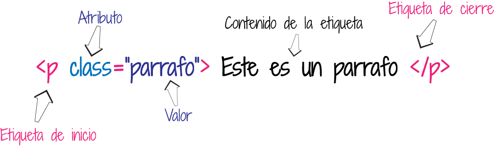
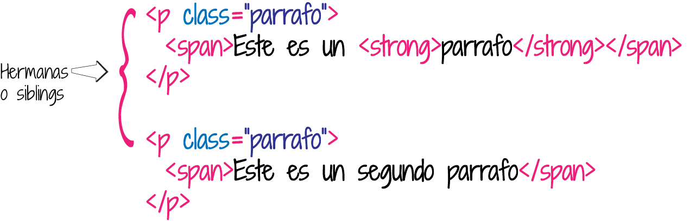
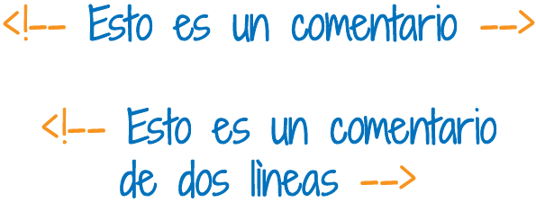

# 📄 ¿Qué es HTML? 📄

## 💡Introducción al HTML💡

Las siglas de HTML en ingles significan: **HyperText Markup Language** o lenguaje de marcado de Hipertexto en nuestro idioma.

El HTML, es el lenguaje base con el que se hacen las páginas web.

No es un lenguaje de programación, sino un lenguaje descriptivo, una serie de etiquetas 🏷️ que el navegador reconoce para mostrar el contenido en la pantalla 💻.

### Estructura básica de una página Web

Una página o documento HTML contiene unas etiquetas que son indispensables:

**&lt;!doctype&gt;** es el tipo de documento, desde la versiòn de html5 el tipo de documento se colocala con la siguiente etiqueta: _**&lt;!doctype html&gt;**_ 

**&lt;html&gt;** Aquí irá todo el contenido de nuestra página, esta etiqueta puede tener el atributo _**lang**_, que especifica el lenguaje de la página **&lt;/html&gt;** 

Dentro de las etiquetas anteriores \(_**&lt;html&gt;&lt;/html&gt;**_\) van dos pares de etiquetas muy importantes:

**&lt;head&gt;** Son etiquetas cabecera del documento, contienen información sobre la página, estas contienen unos meta tag que brindan información adicional del documento, ademas en estas pueden ser incluidos alguos tags como: &lt;title&gt;&lt;/title&gt;, &lt;link&gt;, &lt;script&gt;**&lt;/head&gt;**

**&lt;body&gt;** Estas etiquetas son el cuerpo del documento, aquí es donde incluimos todas las etiquetas para nuestro contenido, como: **&lt;div&gt;&lt;/div&gt;&lt;p&gt;&lt;/p&gt;**, entre otras**&lt;/body&gt;**

\*\*\*\*


Todas las etiquetas deben cerrarse. Hay etiquetas que tienen una que abre y cierra como esta: **&lt;p&gt;&lt;/p&gt;**

y hay otras etiquetas que no requieren un par, se puede hacer el cierre en una sola, como: **&lt;img /&gt;**


### Sintaxis de un elemento

Un elemento de un documento HTML, tiene una representaciòn o significado semántico. El _**&lt;title&gt;&lt;/title&gt;**_ representa el titulo del documento y solo se incluye en el _**&lt;head&lt;/&lt;head&gt;**_ del documento.

La mayoria de etiquetas tienen un tag o etiqueta de inicio y de cierre, y pueden contener atributos, que definen unas propiedades adicionales. Por ejemplo:

### Anidamiento \(Nesting\)

Las etiquetas pueden contener en su interior otras etiquetas. Si creamos dos etiquetas tipo parrafo, y dentro de cada una de ellas incluimos mas etiquetas, las dos etiquetas &lt;p&gt;&lt;/p&gt;, estarian al mismo nivel y serian hermanas \(siblings\) y las etiquetas internas dentro de cada una, se convertirian en etiquetas padres que anidan otras etiquetas o tienen etiquetas hijas.

### Comentarios

Los comentarios se incluyen en el marcado para hacer las etiquetas faciles de entender. Puede ser de ayuda para quien este leyendo tu documento HTML, para entender que estas haciendo Estos no se visualizan en el documento. Los comentarios inician con _**&lt;!--**_ y terminan con _**--&gt;**_.

### **Tipos de elementos del HTML**

Los elementos del HTML se pueden colocar en dos grupos, los elementos de **bloque** \(**block**\) y los elementos en **línea** \(**inline**\). Los de bloque ocupan el 100% del ancho disponible para este y hacen un salto de línea. Los elementos en línea, se colocan en la misma línea uno seguido del otro, ocupan el ancho de su contenido.

En bloque: **&lt;div&gt;&lt;/div&gt;**, **&lt;p&gt;&lt;/p&gt;**, **&lt;h1&gt;&lt;/h1&gt;** hasta **&lt;h6&gt;&lt;/h6&gt;**, **&lt;form&gt;&lt;/form&gt;**, **&lt;ol&gt;&lt;/ol&gt;**, **&lt;ul&gt;&lt;/ul&gt;**, **&lt;li&gt;&lt;/li&gt;**, **&lt;section&gt;&lt;/section&gt;**, **&lt;article&gt;&lt;/article&gt;**, entre otras.

En línea: **&lt;img /&gt;**, **&lt;a&gt;&lt;/a&gt;**, **&lt;span&gt;&lt;/span&gt;**, **&lt;strong&gt;&lt;/strong&gt;**, **&lt;i&gt;&lt;/i&gt;**, **&lt;input /&gt;**, **&lt;button&gt;&lt;/button&gt;**

Es recomendable por semántica no colocar elementos en bloque dentro de los inline.

Existen muchas etiquetas, las cuales puedes ampliar la información en el siguiente link, en él puedes encontrar atributos de estas etiquetas, más etiquetas de acuerdo a su significado, con sus respectivos ejemplos: [mdn](https://developer.mozilla.org/es/docs/Web/HTML).

 

