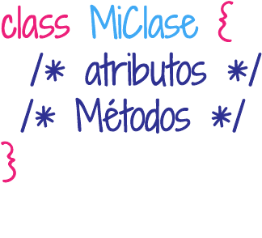

# 🤓 ¿Qué es TypeScript? 🤓

## 🤓Introducción a TypeScript🤓


TypeScript es un lenguaje de programación, se puede decir que es un super JavaScript tipado. Fue creado para hacer código JavaScript mucho más escalable.

Se dice que typeScript es un superset, porque es un lenguaje escrito encima de otro lenguaje, que compila a otro lenguaje. En el caso de TypeScript es un lenguaje que compila a JavaScript, pero que incluye muchas facilidades y ventajas.

TypeScript soluciona muchos de los problemas que presenta JavaScript:

* Falta de un tipado fuerte y estático.
* Falta de «Syntactic Sugar o Azucar sintáctico» para la creación de clases.
* Falta de interfaces
* Falta de Modulos \(aunque se usa el require.js\)

## ¿Qué necesitamos para usar TypeScript?

Necesitamos descargar node.js y una vez descargado en nuestra terminal preferida, sea la de por defecto del sistema operativo, colocamos la siguiete línea:

```bash
npm install -g typescript
```

Si desearamos crear una archivo de Typescript solo tendriamos que hacerlo colocandole despues del nombre la extesion.ts


```typescript
const a:number = 9;
a += 4;

function mostrar(b:string) :void{
  console.log(b);
}

mostrar('hola');
```


Dentro del archivo podemos crear una función como la siguiente y para ejecutar se archivo, en nuestra terminal ejecutamos lo siguiente:

```typescript
tsc ejemplo.ts
```

## Tipos de Datos

En typescript se puede hacer uso de los tipos de datos de JavaScript, pero tambien tiene sus tipos de datos. Los básicos son:

* **Booleans**: tipo de dato lógico
* **Number**: tipo de dato númerico.
* **String**: tipo de dato de cadena de caracteres.
* **Any**: se usa cuando no queremos declarar un tipo de dato, quiere decir que su contenido puede ser algun tipo de dato. Se puede usar cuando tenemos arrays que tienen varios tipos de datos.
* **Void**: se usa para declarar funciones que no retornan nada.

```typescript
const esVisible: boolean = false;
const tamaño: number = 6;
const nombre: string = "Vane";
const list:number[] = [1, 2, 3];
const nose: any = 4;
function saludo(): void {
    console.log("Este es un saludo!!");
}
```

## Clase o Class

Como habiamos mencionado en JavaScript, una clase  nos sirve para agrupar objetos. Se podría decir que una Clase es como un Objeto de JavaScript. TypeScript es básado en el paradigma de programación orientada a Objetos. Una clase tiene atributos y métodos. Los atributos son variables internas de la clase, aveces a estos se les llama estado de la clase. Los métodos, son las acciones a realizar dentro de la clase.



Para crear una clase usamos la palabra reservada class seguido del nombre.

```typescript
class Persona {
}
```

Los objetos que se crean a partir de la clase se llaman instancia de la clase.

Para crear un objeto usando la clase, lo hacemos así:

```typescript
const miObjeto = new Persona();
```


