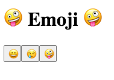

# 👩🏻‍🎓 Retos en Angular 👩🏻‍🎓

## Botones de Emojis



Para esta aplicación te invito a hacer uso las directivas, vamos a crear 3 botones, que podemos añadirles emojis en ellos, cuando de click sobre el botón deberá aparecer un imagen.

Crea una aplicación en Stackblitz o localmente.

* En tu app.html crea tres botones, como te mostraré a continuación:

```markup
<button>😀</button>
<button>😢</button>
<button>🤪</button>
```

* Te mostraré como se hace para un boton y tu debes hacer los otros. Entonces en tu boton debemos añadir un evento click, este nos permite interactuar con una variable que crearemos, y en ella al darle click nos permitirá ver la imagen que queremos mostrar. Nuestro primer botón quedaría así:

```markup
<button (click)="happy=!happy">😀</button>
<section *ngIf="happy">
  
</section>
```

Ademas añadí la imagen que deseaba mostrar, si vez el código veras que en click estoy haciendo colocando una variable y estoy asignando la misma variable pero negada, eso indica que si le doy click va a mostrar y ocultar la imagen.

* En nuestro app.component.ts vamos a crear nuestra variable dentro de nuestra clase. La declararemos tipo boolen y la haremos igual a **false**. Quedaría asi:

```typescript
import { Component } from '@angular/core';

@Component({
  selector: 'my-app',
  templateUrl: './app.component.html',
  styleUrls: [ './app.component.css' ]
})
export class AppComponent  {
  happy: boolean = false;
}
```

Añade una variable para el emoji triste y el crazy, puedes añadir más botones si gustas y la idea es que le añadas la variable al evento click del boton correspondiente.

Puedes personalizarlo como gustes.

## 

El ejercicio resulto lo puedes encontrar aquí:







