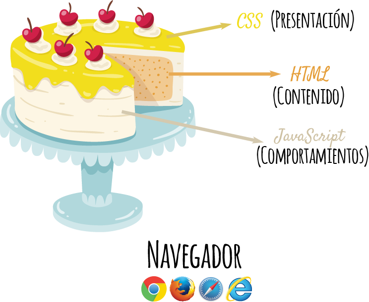

# 🗺️ Elementos de la Web 🗺️

En la Web las 3 capas o elementos más importantes son el HTML, CSS y JavaScript.

## HTML

Nos permite crear el contenido de nuestro documento: texto imagenes, videos, etc.

## CSS

Nos permite darle formato a nuestro contenido. Ponerlo botito, que nuestro documento se vea agradable a la vista del usuario.

## JavaScript

Nos permite manejar las diferentes interacciones que nuestro usuario pueda tener con el contenido. Se pueden manejar diferentes eventos con él, incluso se puede editar el formato del documento.

