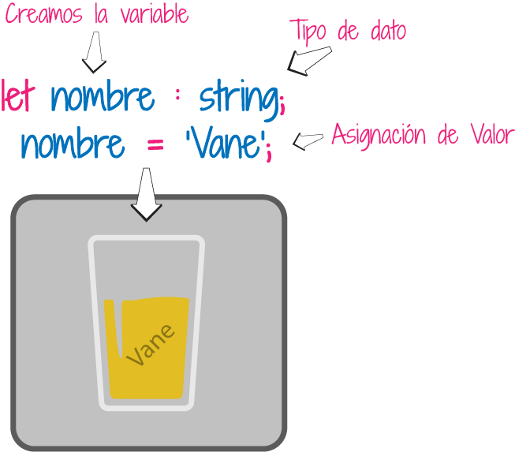
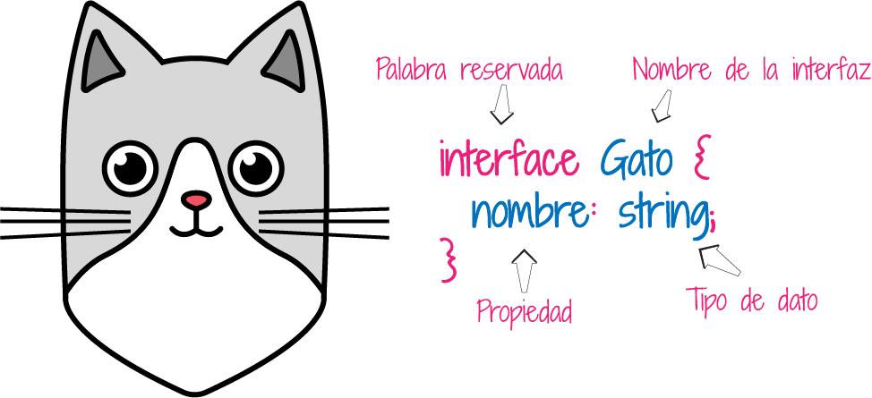
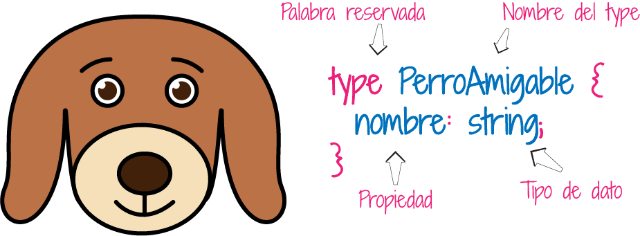
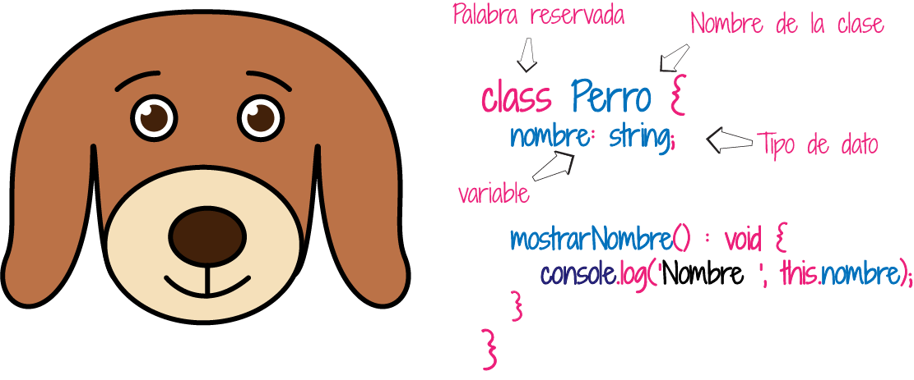
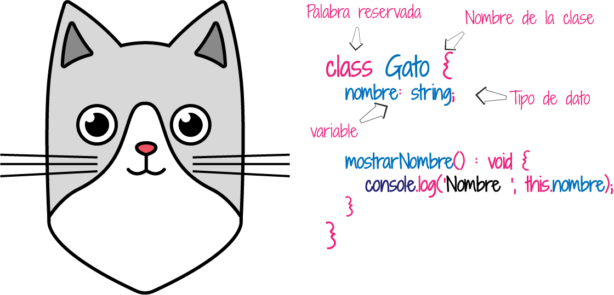

# 🤓 TypeScript 🤓

## 


TypeScript es un lenguaje de programación, es un super JavaScript con super poderes, tipado. Creado para hacer código JavaScript mucho más escalable.

Se dice que typeScript es un superset, porque es un lenguaje escrito encima de otro lenguaje, que compila a otro lenguaje. En el caso de TypeScript es un lenguaje que compila a JavaScript, pero que incluye muchas facilidades y ventajas.

Microsoft es el creador de TypeScript. y es un lenguaje que se mantiene a la vanguardia con las mejoras de JavaScript.

TypeScript utiliza el paradigma de programación Orientado a Objetos, donde podemos incluir clases como otros lenguajes como Java, C\#, entre otros. A partir de la versión ES6 JavaScript implementa clases y es muy similar su uso al de TypeScript.

Con TypeScript no solo se desarrollan aplicacion en Angular, también se pueden realizar en otros frameworks como Vue,js o librerías como React.

### Tipado Estático

Un lenguaje tiene tipado estático cuando tiene las siguientes características:

* Las variables tienen un tipo de dato.
* Los valores que se le asignan a las variables, corresponden a su tipo de dato.



```typescript
let nombre: string;              // tipo de dato cadena de carácteres   
nombre = 'Vane';                // Asignamos una cadena de carácteres
```

Hay otras características como:

* Interfaces
* Conversión de tipos \(casting\)
* Argumentos con tipos de datos
* Tipos de datos en los retornos de una función
* Genéricos

## Tipos de Datos

En typescript se puede hacer uso de los tipos de datos de JavaScript, pero tambien tiene sus tipos de datos. Los básicos son:

* **Booleans**: tipo de dato lógico
* **Number**: tipo de dato númerico.
* **String**: tipo de dato de cadena de caracteres.
* **Any**: se usa cuando no queremos declarar un tipo de dato, quiere decir que su contenido puede ser algun tipo de dato. Se puede usar cuando tenemos arrays que tienen varios tipos de datos.
* **Void**: se usa para declarar funciones que no retornan nada.

```typescript
const esVisible: boolean = false;
const tamaño: number = 6;
const nombre: string = "Vane";
const list:number[] = [1, 2, 3];
const nose: any = 4;
function saludo(): void {
    console.log("Este es un saludo!!");
}
```

## Interfaces

Las interfaces nos ayudan a definir las variables o métodos que vamos a usar. Se dice que define el contrato, la sintaxis que la clase debe seguir en su estructura. La interfaz se usa para la verificación de los tipos de datos que se usarán en la clase, a  esta verificación se le  conoce como "tipificación de pato" \("duck typing"\) o "subtipificación estructural" \("structural subtyping"\). Se define usando la palabra reservada _**interface**_, seguida del nombre de la interface con la primera letra en mayuscula. Y colocamos dentro entra las llaves las propiedades y métodos con el tipo de dato.



```typescript
interface Gato {
    nombre: string;
    raza: string;
    color: string;
}
```

Podemos extender otras propiedades de otras interfaces. Podemos usar la palabra reservada _**extends**_, para que una interface herede las propiedades de otra.

```typescript
interface Perro extends Gato {
    tieneCola: boolean;
}
```

## Type

Un type nos permite definir el tipo de dato que vamos a usar en nuestras propiedades y métodos; pero a diferencia de als interfaces no podemos extender un type, ni ampliar sus capacidades. Pero si podemos declarar tipos personalizados y puede tener varios tipos de datos.

Se declara usando la palabra reservada _**type**_, seguido del nombre del type iniciando con mayuscula inicial la primera letra, y entre llaves colocaremos las propiedades y métodos, con su respectivo tipo.



```typescript
type Gato {
    normbre: string;
}

type PerroAmigable = {
    esAmigable: boolean;
}

type GatoYPerroAmigable = Gato & PerroAmigable;
```

```typescript
type Perro = string | number;
```

## Clase o Class

TypeScript es básado en el paradigma de programación orientada a Objetos. Una clase tiene atributos y métodos. Los atributos son variables internas de la clase, aveces a estos se les llama estado de la clase. Los métodos, son las acciones a realizar dentro de la clase.


Para crear una clase usamos la palabra reservada class seguido del nombre.


```typescript
class TiendaMascotas {
}
```

Los objetos que se crean a partir de la clase se llaman instancia de la clase.

Para crear un objeto usando la clase, lo hacemos así:

```typescript
const miMascota = new TiendaMascotas();
```

```typescript
class TiendaMascotas {
    nombre:string;
    constructor(nuevoNombre:string) {
       this.nombre = nuevoNombre;
    }

    mostrarNombreMascota(): void {
       console.log(this.nombre);
    }
    
    obtenerNombreMascota(): string{
        return this.nombre;
    }
}
```

Se usa el “this”  para acceder a los atributos y métodos  de la clase. "this" hace referencia al objeto de la clase.

La funcion 'constructor' es un método propio de la clase y nos permite construir el objeto.

### Otro Ejemplo






