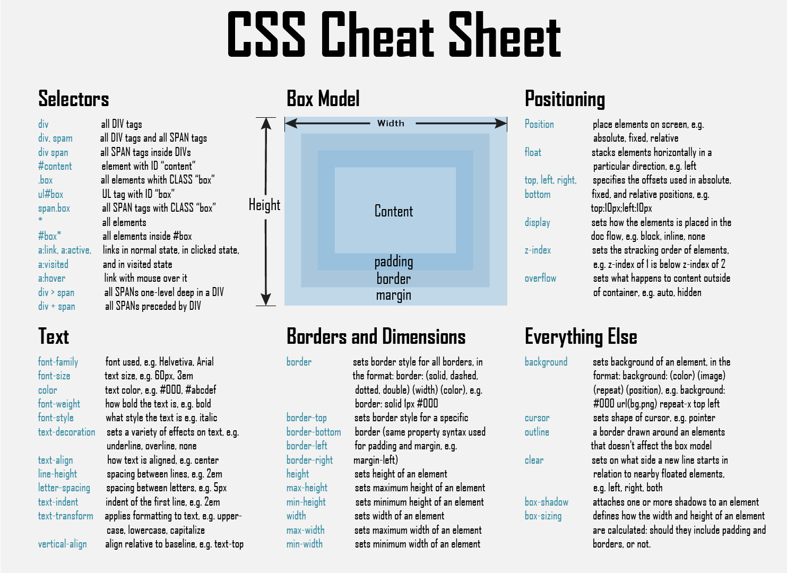

# 🕸️Elementos de la Web🕸️

Haciendo una repetición de lo que mencionamos en el nivel anterior, en la Web existe 3 capas o elementos muy importantes, que son el HTML, CSS y JavaScript.

## HTML

Nos permite crear el contenido de nuestro documento: texto imagenes, videos, etc. Este contenido lo hacemos de forma semántica.

.png>)

## CSS

Nos permite darle formato a nuestro contenido. Ponerlo bonito, que nuestro documento se vea agradable a la vista del usuario.

## JavaScript

.png>)

Nos permite manejar las diferentes interacciones que nuestro usuario pueda tener con el contenido. Se pueden manejar diferentes eventos con él, incluso se puede editar el formato del documento.

De JavaScript en el nivel 0, puedes encontrar definiciones de algunos conceptos que te pueden ayudar, en el caso de que haya algún concepto en el cúal tengas dificultades e incluso puedes profundizarlos en la página de [mdn](https://developer.mozilla.org/es/docs/Web/JavaScript).

En Angular, hacemos uso de muchos conceptos de JS, en especial las Clases, en el nivel 0 mencione brevemente sobre ellas e igual es un concepto que es retomado en TypeScript.
