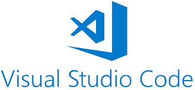
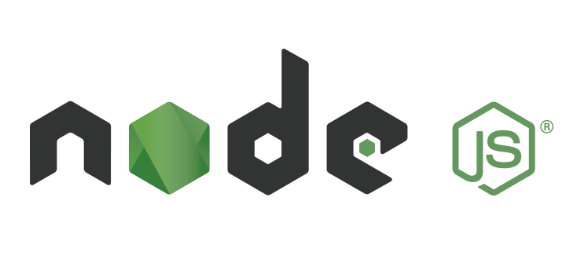
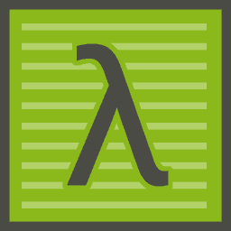
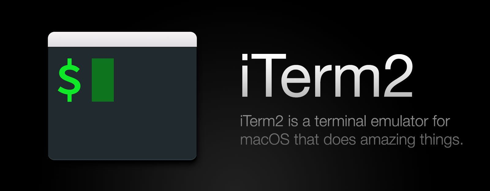

# ⚙️Herramientas⚙️

En los niveles anteriores mencionamos varias herramientas que nos son de mucha ayuda, para crear código, mantenerlo, almacenarlo por versiones.

En esta sección voy a repetir nuevamente esas herramientas para que no sea necesario ir al nivel anterior a revisarlos. Ademas solo hacer enfasis en las herramientas que usaremos exclusivamente en este nivel.

## Editores de código o texto

Un editor de código o de texto, es un programa que nos permite en el crear nuestras lineas de código. Un bloc de notas nos puede servir como un editor de texto, aunque existen programas más especializados que dependiendo del lenguaje nos mostrará nuestro código por colores, incluso podrá mostrarnos nuestros errores al ejecutar incorrectamente alguna palabra clave de nuestro lenguaje.

Y estos más especializados los llamamos IDE  (Integrated Development Environment) o **Entorno de Desarrollo Integrado**. Los IDE tienen un editor de texto, ademas tienen algunas funciones avanzadas como autocompletar el código, se puede integrar con sistemas de control de versiones, algunos pueden simular dispositivos y pueden gestionar la conección con la base de datos.

****[**Stackblitz**](https://stackblitz.com) es un IDE en la nube que te permite crear aplicaciones Web. Eso quiere decir que ¡no tienes que instalar nada para crear tu aplicación! 😎

Podemos seguir esta guia para aprender como usar stackblitz. [https://ngchallenges.gitbook.io/project/guias-utiles/stackblitz](https://ngchallenges.gitbook.io/project/guias-utiles/stackblitz)

De manera local en nuestras máquinas usaremos [Visual Studio Code](https://code.visualstudio.com), te recomiendo descargarlo e instalarlo en tu computadora de acuerdo a tu sistema operativo.

## Manejador de versiones

Para que no tengamos la necesidad de por cada cambio que hagamos en nuestro código y tener ese paso a paso, guardado en algun lugar, evitandonos crear multiples carpetas por versiones como lo haciamos cuando creabamos documentos en sus multiples versiones, existen unas aplicaciones que nos ayudan a manejar el versionamiento, y la que usaremos será [Github](https://github.com).&#x20;

Podemos seguir la siguiente guia para crear nuestra cuenta en github: [https://ngchallenges.gitbook.io/project/guias-utiles/github](https://ngchallenges.gitbook.io/project/guias-utiles/github)

## Otras Herramientas

Para hacer la instalación de Angular, de manera local en nuestras computadoras, necesitaremos tener instalado [**node.js**](https://nodejs.org/es/) (es un entorno en tiempo de ejecución multiplataforma) y un manejador de paquetes como **** [**npm** ](https://www.npmjs.com)(Node Package Manager o simplemente npm es un gestor de paquetes). Te recomiendo instalarlos de acuerdo a tu sistema operativo.

Para ejecutar ciertos comandos es necesario hacer uso de la terminal. Para aquellos que tengan visual studio code, pueden usar la terminal que esta tiene integrada, o en el caso de que tengas Windows, puedes usar [cmder](https://cmder.net) y en el caso de MacOS, pueden usar terminal o [iterm](https://www.iterm2.com). Para linux, dependiendo del paquete de distribución existen muchas opciones ([Terminator](https://terminator-gtk3.readthedocs.io/en/latest/)).

